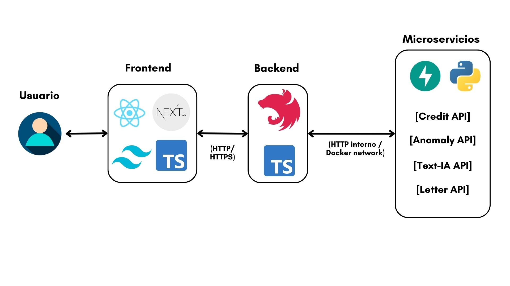

# Risk-Intelligence-Suite

**Risk-Intelligence-Suite** es una plataforma modular de **evaluación de riesgo crediticio** que integra modelos de *Machine Learning*, explicabilidad y generación de **cartas de evaluación preliminar**, diseñada con una **arquitectura de microservicios** orientada a escalabilidad, auditabilidad y separación de responsabilidades.

El proyecto simula un flujo real de una institución financiera, donde la **decisión no depende de un LLM**, sino de reglas de negocio y modelos entrenados. La IA generativa se utiliza **exclusivamente para la explicación**, bajo controles éticos y normativos.

---

## Arquitectura general

El sistema está dividido en tres capas principales:

- **Frontend**: interfaz de usuario para clientes y ejecutivos  
- **Backend**: orquestador de negocio y persistencia  
- **Microservicios de IA**: scoring, explicabilidad, NLP y anomalías  



### Flujo principal

1. El usuario envía una solicitud desde el frontend.
2. El backend persiste la solicitud y llama al microservicio **Credit API**.
3. El modelo devuelve probabilidad, banda de riesgo y factores explicativos (SHAP).
4. El backend calcula la **decisión preliminar** mediante reglas de negocio.
5. El microservicio **Letter API** genera una carta explicativa ética y no discriminatoria.
6. El frontend muestra los resultados y la carta de explicabilidad.

---

## Stack tecnológico

### Frontend

- **Next.js + React**
- **TypeScript**
- **Tailwind CSS**
- Consumo de API REST
- Manejo de estados de carga (scoring inmediato vs generación de carta asíncrona)

### Backend

- **NestJS (TypeScript)**
- **MongoDB**
- Orquestación de microservicios
- Reglas de negocio explícitas (no delegadas al LLM)
- Manejo de reintentos y tolerancia a *cold-start*

### Microservicios de IA

- **FastAPI (Python)**
- Docker / Docker Compose
- Comunicación interna vía red Docker

---

## Microservicios

### Credit API (`ml-credit`)

Microservicio responsable del **scoring crediticio** y la **explicabilidad local**.

- Modelo entrenado sobre el **South German Credit Dataset**
- Pipeline de inferencia + SHAP
- Endpoints:
  - `POST /score`
  - `GET /health`
- Devuelve:
  - `probabilityDefault`
  - `riskBand`
  - `topFeatures` (impacto local por variable)

> El modelo **no toma decisiones finales**, únicamente genera señales explicables.

---

### Letter API (`ml-letter`)

Microservicio encargado de la **generación de cartas de evaluación preliminar**.

Pipeline interno:

1. Filtrado de **features sensibles** (sexo, edad, nacionalidad, etc.)
2. Recepción de decisión ya definida por el backend
3. RAG ligero con políticas internas
4. Few-shot prompting con formato controlado

- Endpoint:
  - `POST /letter`
- Garantías:
  - Lenguaje no discriminatorio
  - Enfoque ético y normativo
  - Explicación consistente con el modelo
  - El LLM **no modifica la decisión**

---

### 3️⃣ Text-IA API (diseñado / opcional)

- Clasificación de texto libre
- Pensado para alertas, análisis semántico o categorización de eventos

---

### 4️⃣ Anomaly API (diseñado / opcional)

- Detección de patrones atípicos
- Enfocado a fraude o validaciones adicionales

---

## Organizacion carpetas

```text
risk-intelligence-suite/
├── README.md
├── docker-compose.yml          # Opcional pero muy bueno para la demo
├── .gitignore
├── package.json                # Del frontend
│
├── docs/
│   ├── architecture.md         # Detalle de arquitectura y módulos 2 y 3
│   └── api_contracts.md        # Esquemas JSON y ejemplos de requests/responses
│
├── data/
│   ├── raw/                    # Datasets originales (gitignored)
│   ├── processed/              # Datasets limpios / features (gitignored)
│   └── README.md               # De dónde salen los datos, enlaces a fuentes
│
├── notebooks/
│   └── 01_credit_eda_training.ipynb  # EDA + entrenamiento inicial
│
├── infra/
│   ├── env.example             # Variables de entorno ejemplo (ports, URIs)
│   └── mongo-init.js           # Opcional: índices, colecciones, seeds
│
├── backend/                    # API de negocio (FastAPI + Mongo)
│   ├── src/
│   │   ├── main.py             # Crea app FastAPI, incluye routers
│   │   ├── config.py           # Config (env vars, URLs de servicios, etc.)
│   │   ├── db.py               # Conexión a MongoDB
│   │   ├── models.py           # Esquemas Pydantic de dominio
│   │   ├── repositories.py     # Acceso a BD (CRUD)
│   │   ├── services/           # Lógica de negocio
│   │   │   ├── credit_service.py    # Orquesta scoring + carta
│   │   │   ├── text_service.py      # Stub para módulo NLP
│   │   │   └── anomaly_service.py   # Stub para módulo anomalías
│   │   ├── routers/            # Endpoints expuestos
│   │   │   ├── applications.py  # /applications, /applications/{id}
│   │   │   ├── health.py        # /health
│   │   │   └── letters.py       # (opcional) /applications/{id}/letter
│   │   └── utils/
│   │       ├── logging.py       # Logger estructurado (si lo usas)
│   │       └── schemas_shared.py # Tipos compartidos para contratos
│   ├── tests/
│   │   └── test_applications.py # Tests de endpoints clave
│   └── request.txt             # requirements backend
│
├── ml-credit/                  # Microservicio 1: scoring + SHAP
│   ├── models/                 # Modelos entrenados (.joblib, .pkl)
│   │   ├── credit_pipeline.joblib
│   │   └── shap_background.npy # (opcional) background para SHAP
│   ├── artifacts/              # Métricas, feature importance global, etc.
│   │   └── metrics_credit_v1.json
│   ├── src/
│   │   ├── main.py             # FastAPI app con /score y /health
│   │   ├── config.py           # Rutas de modelos, versionado
│   │   ├── data.py             # Carga y preprocesamiento de dataset
│   │   ├── training.py         # Entrenamiento y guardado de modelos
│   │   ├── inference.py        # Funciones de scoring + SHAP local
│   │   └── schemas.py          # Pydantic models para request/response /score
│   ├── tests/
│   │   └── test_inference.py
│   └── request.txt             # requirements ml-credit
│
├── ml-letter/                  # Microservicio 1.5: “Cartas de explicabilidad”
│   ├── templates/              # Plantillas base de cartas (Jinja2 o similar)
│   │   ├── decline_es.txt
│   │   ├── approve_es.txt
│   │   └── review_es.txt
│   ├── src/
│   │   ├── main.py             # FastAPI app con /generate_letter
│   │   ├── config.py           # Feature flags (template vs LLM), etc.
│   │   ├── templates_engine.py # Lógica para armar carta desde reason_codes
│   │   ├── schemas.py          # Pydantic para request/response de cartas
│   │   └── llm_client.py       # (opcional) stub de cliente LLM
│   ├── tests/
│   │   └── test_templates_engine.py
│   └── request.txt             # requirements ml-letter
│
├── ml-text/                    # Módulo 2 (diseñado / opcional)
│   ├── src/
│   │   ├── main.py             # FastAPI con /classify_text (stub o simple)
│   │   ├── config.py
│   │   ├── preprocessing.py
│   │   ├── training.py         # TF-IDF + Logistic (si da tiempo)
│   │   ├── inference.py
│   │   └── schemas.py
│   ├── models/                 # Modelo de texto
│   └── request.txt             # requirements ml-text
│
├── ml-anomaly/                 # Módulo 3 (diseñado / opcional)
│   ├── src/
│   │   ├── main.py             # FastAPI con /detect_anomalies (stub o simple)
│   │   ├── config.py
│   │   ├── training.py         # Isolation Forest / LOF / autoencoder
│   │   ├── inference.py
│   │   └── schemas.py
│   ├─── models/
│   └── request.txt             # requirements ml-anomaly
│
├── vector-store/               # Integración futura con base vectorial
│   ├── src/
│   │   ├── client.py           # Cliente para Chroma/Qdrant
│   │   ├── embeddings.py       # Cómo generas embeddings de casos
│   │   └── indexer.py          # Cómo indexas solicitudes ya guardadas
│   └── README.md               # Diseño del endpoint /applications/{id}/similar
│
└── frontend/                   # Next.js + Tailwind
    ├── app/
    │   ├── layout.tsx
    │   ├── page.tsx            # landing / explicación del producto
    │   ├── client/
    │   │   └── page.tsx        # simulador de crédito (vista cliente)
    │   ├── executive/
    │   │   ├── page.tsx        # lista de solicitudes
    │   │   └── [id]/page.tsx   # detalle de una solicitud
    │   └── components/
    │       ├── RiskBadge.tsx   # chip de LOW/MEDIUM/HIGH
    │       ├── FeatureList.tsx # lista de top_features
    │       ├── LetterCard.tsx  # muestra carta de explicabilidad
    │       └── LayoutShell.tsx # layout general
    ├── lib/
    │   └── api.ts              # funciones para llamar al backend
    ├── styles/
    │   └── globals.css
    ├── tailwind.config.js
    └── tsconfig.json
```

Cada microservicio es independiente, versionable y reemplazable.

## Dataset

Se utilizó el South German Credit Dataset, ampliamente usado en investigación de riesgo crediticio:

UCI Machine Learning Repository
<https://archive.ics.uci.edu/dataset/573/south+german+credit+update>

Kaggle mirror
<https://www.kaggle.com/datasets/varunchawla30/german-credit-data/data>

Referencia:

South German Credit Dataset. (2020).
UCI Machine Learning Repository.
<https://doi.org/10.24432/C5QG88>

---

## Instalación y ejecución

### Modo desarrollo (local)

<!-- Para instalar -->
```bash
cd Risk-Intelligence-Suite

python -m venv .venv
source .venv/bin/activate

pip install -e ./ml-credit
pip install -r notebooks/requirements.txt
```

Ejecutar un microservicio de forma individual:

```bash
cd services/credit-api
uvicorn app.main:app --reload --port 8000
```

### Modo Docker / Compose (recomendado para demo)

```bash
cd Risk-Intelligence-Suite
docker compose up --build
```

Servicios levantados por defecto:

- Frontend: <http://localhost:3000>
- Backend: <http://localhost:5000>
- Credit API: <http://localhost:8000>
- Letter API: <http://localhost:8001>

<!-- correr FastAPI localmente -->
<!-- cd services/credit-api
uvicorn app.main:app --reload --host 0.0.0.0 --port 8000 -->

### Principios de diseño

- El LLM no decide
- Las reglas de negocio son explícitas y auditables
- Explicabilidad local mediante SHAP
- Filtrado de variables sensibles
- Arquitectura orientada a producción
- Preparado para crecimiento (colas, cache, versionado)

### Estado del proyecto

- MVP funcional end-to-end
- Demo técnica con microservicios
- Arquitectura escalable
- Enfoque ético y explicable

Este proyecto fue diseñado como una demostración realista de un sistema de riesgo crediticio moderno, integrando Machine Learning, explicabilidad y buenas prácticas de ingeniería de software.
